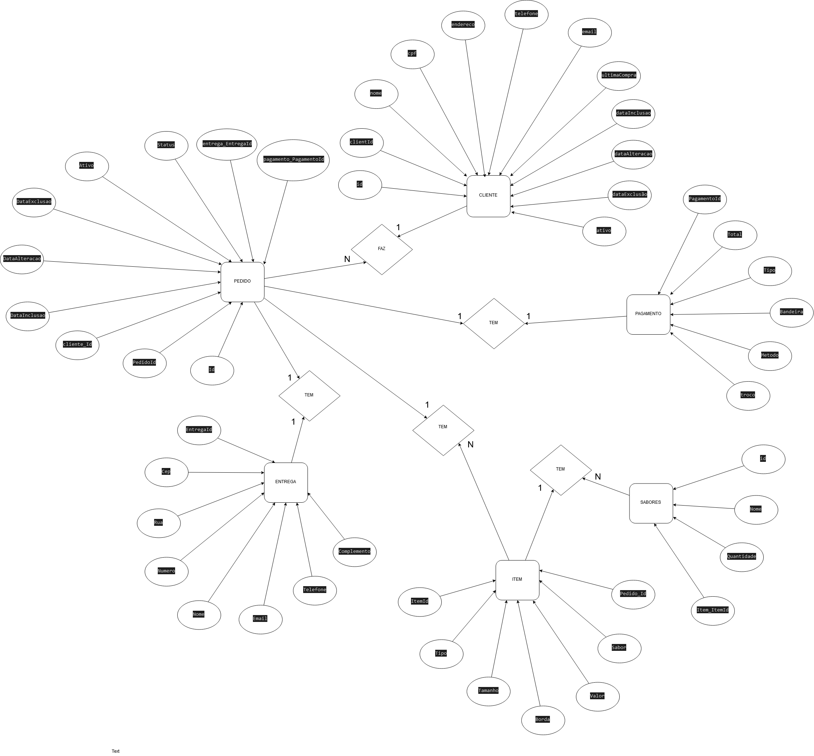

# Modelo conceitual
1. Cliente
    - **Dados necessários:** Nome, E-mail, Telefone, CEP, Rua, Número, Complemento
2. Pedido
    - **Dados necessários::** Preço, Forma de pagamento, Descrição(Todos os dados do pedido)

# Modelo lógico

# Modelo físico

1. Cliente 

| Nome do campo | Tipo de dados | Tamanho |
| ---           | ---           | ---     |
| nome          | varchar       | 200     |
| email         | varchar       | 150     |
| telefone      | bigint        | 16      |
| cep           | varchar       | 20      |
| complemento   | varchar       | 100     |
| numero        | varchar       | 10      |
| rua           | varchar       | 150     |

2. Pedido 

| Nome do campo   | Tipo de dados | Tamanho |
| ---             | ---           | ---     |
| descricao       | text          | 999     |
| preco           | decimal       | 10,2    |
| forma_pagamento | bigint        | 16      |