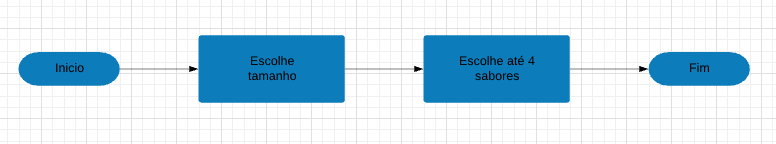

# Fluxograma de processos
## O fluxo do sistema de resume da seguinte maneira 

## Fazer pedido
### A primeira etapa do sistema é iniciada com a geração de um pedido por um cliente, que irá adicionar a quantidade de combos/pizzas que desejar ao seu pedido e então finaliza-lo  

### Pedir combo  

### Pedir avulsa  

### Finalizar pedido  

## Enviar e-mail
### Após a conclusão do pedido o sistema irá enviar um e-mail ao cliente 

## Gerenciar pedidos
### Após a conclusão do pedido, o mesmo também irá ser adicionado ao portal do dono da pizzaria o permitindo removê-lo após a conclusão do mesmo 

